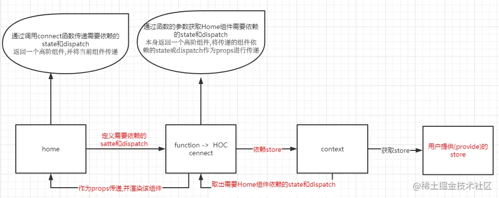

## 安装

```
pnpm install redux react-redux -S
```

## Provider

Provider 是一个 react 组件，提供了一个参数 store，
然后渲染了一个子组件，我们通常把路由渲染成子组件，最后还处理了一个异常情况，提供了 warning 提示

### 使用

```typescript
import { Provider } from 'react-redux';
import store from './store';
const App = (
  <Provider store={store}>
    <Home />
  </Provider>
);
```

### 源码

```typescript
import { Component, Children } from 'react';
import PropTypes from 'prop-types';
import storeShape from '../utils/storeShape';
import warning from '../utils/warning';

export default class Provider extends Component {
  getChildContext() {
    return { store: this.store };
  }

  constructor(props, context) {
    super(props, context);
    this.store = props.store;
  }

  render() {
    return Children.only(this.props.children);
  }
}
```

## connect

React-Redux 提供 connect 方法，用于从 UI 组件生成容器组件。connect 的意思，就是将这两种组件连起来。

<br/>
connect 接收 4 个参数 `mapStateToProps`, `mapDispatchToProps`,`mergeProps`, `options`,
并返回一个高阶组件，将`state`和`action`注册到组件的 props 上

### 使用

```typescript
export default connect(mapStateToProps, mapDispatchToProps)(组件);
```

### mapStateToProps

connect 第一个参数是个回调函数可以将指定 store 注册在组件 props 上,用来获取 store

```typescript
const mapStateToProps = (state) => {
  console.log('state :', state);
  return state;
};
export default connect(mapStateToProps)(组件);
```

### mapDispatchToProps

connect 第二个参数是个回调函数可以将指定 action 注册在组件 props 上,用来设置 store

```typescript
const mapDispatchToProps = (dispatch:Dispatch<AnyAction>)=>{
    return {
        sendAction:(v:string)=>{
            dispatch({
                type: 'send_type',
                value:v
            })
        }
    }
  export default connect(null, mapDispatchToProps)(组件);
```

### mergeProps

mergeProps 如果不指定，则默认返回 `Object.assign({}, ownProps, stateProps, dispatchProps)`，顾名思义，mergeProps 是合并的意思，将 state 合并后传递给组件。

```typescript
function mergeProps(stateProps, dispatchProps, ownProps) {
  return Object.assign({}, ownProps, {
    todos: stateProps.todos[ownProps.userId],
    addTodo: (text) => dispatchProps.addTodo(ownProps.userId, text),
  });
}
```

### options

通过配置项可以更加详细的定义 connect 的行为，通常只需要执行默认值。

## hooks

### useSelector

```typescript
const smg = useSelector((state: State) => state.value);
```

### useDispatch

```typescript
const dispatch = useDispatch();
// 触发状态修改
dispatch({
  type: 'send_type',
  value: '随机数字' + Math.random(),
});
```

> react-redux 不支持处理异步, 可以使用`redux-thunk` 或 `redux-saga` 中间件
