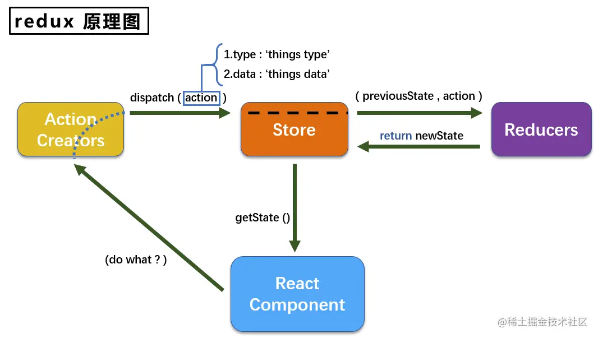

## 安装

`pnpm install redux`
<br/>

[comment]: <> (<Alert type="info">)
[comment]: <> (注意，内部暂时只能编写 HTML)
[comment]: <> (</Alert>)


## 使用

**redux 主要包括 `action`,`store`,`reducer`**

- action
  - 定义操作的类型`type`，和设置的值`value`
- store
  - `store.dispatch(action)` 将 action 传递给 reducer 修改相应的 state,
  - `store.subscribe(()=>{})` 监听 state 变化,
  - `store.getState()` 获取最新的 state
- reducer
  - 接收 action 根据 action.type, action.value 设置相应的 state

## 案例

### store.ts

```typescript
import { createStore } from 'redux';
import { reducer } from '../reducer';
const store = createStore(reducer);

export default store;
```

### action.ts

```typescript
export const setAction = () => {
  return {
    type: 'send_type',
    value: '我是一个action',
  };
};
```

### reducer.ts

```typescript
import { AnyAction } from 'redux';
const initState = {
  value: '默认值',
};
export const reducer = (state = initState, action: AnyAction) => {
  switch (action.type) {
    case 'send_type':
      return Object.assign({}, state, action);
      break;
    default:
      return state;
      break;
  }
};

export default {
  reducer,
};
```

### combineReducers

想要模块化 reducer 时可以用 combineReducers 来合并 render

```typescript
import { createStore } from 'redux';
import userReducer from '../reducer/user';
import shopReducer from '../reducer/shop';
const reducers = combineReducers({
  userReducer,
  shopReducer,
});
const store = createStore(reducers);

export default store;
```

### 组件里使用

```typescript
import React, { useEffect, useState } from 'react';
import { Button, Descriptions } from 'antd';
import store from '@/store';
import { setAction } from '@/action';

export default function Dashboard() {
  const action = setAction();
  const [state, setState] = useState(store.getState().value);

  useEffect(() => {
    // 监听最新的状态
    store.subscribe(() => {
      setState(store.getState().value);
    });
  }, []);
  return (
    <div>
      <Button
        onClick={() => {
          // 触发状态修改
          store.dispatch(action);
        }}
      >
        redux click
      </Button>

      <Descriptions title={state}></Descriptions>
    </div>
  );
}
```
